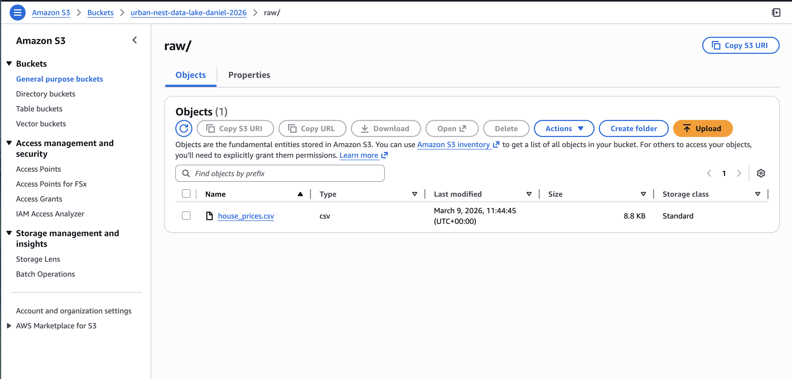
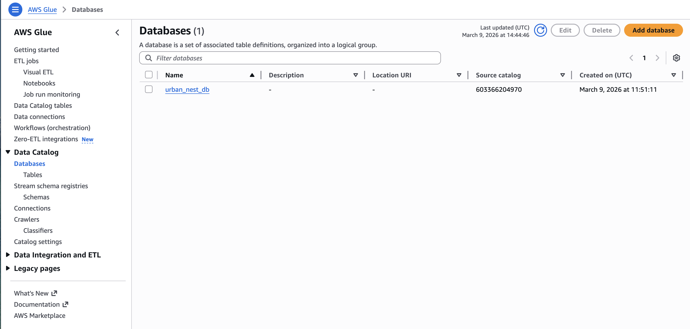
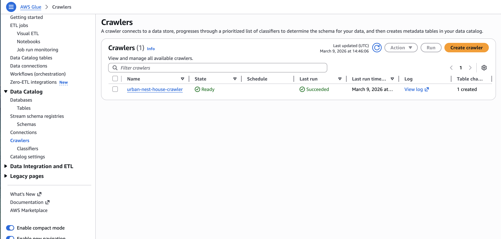
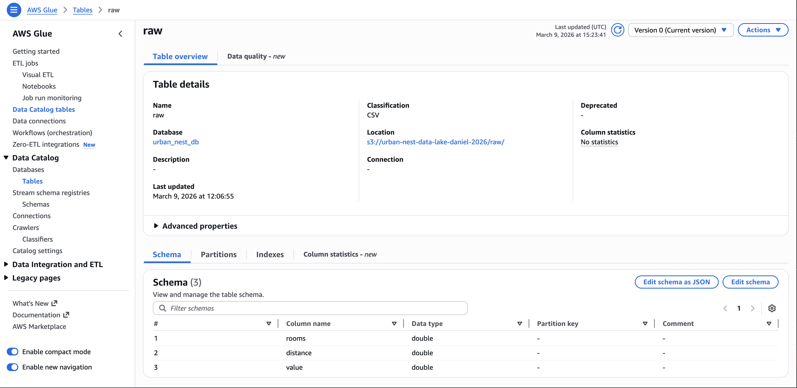
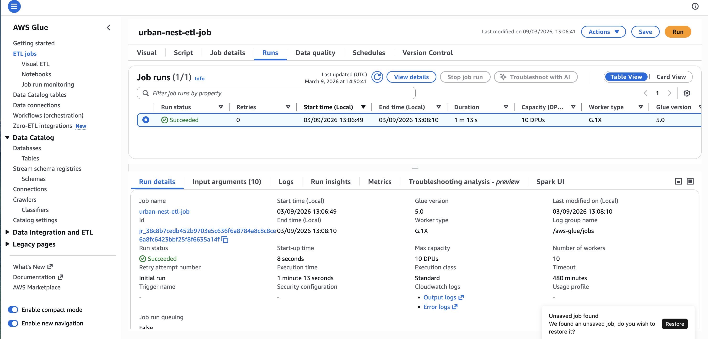
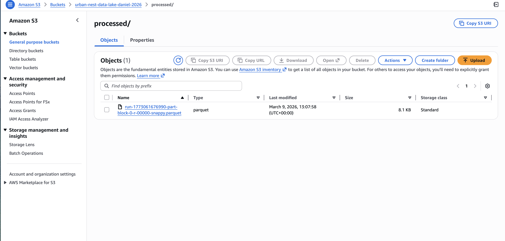
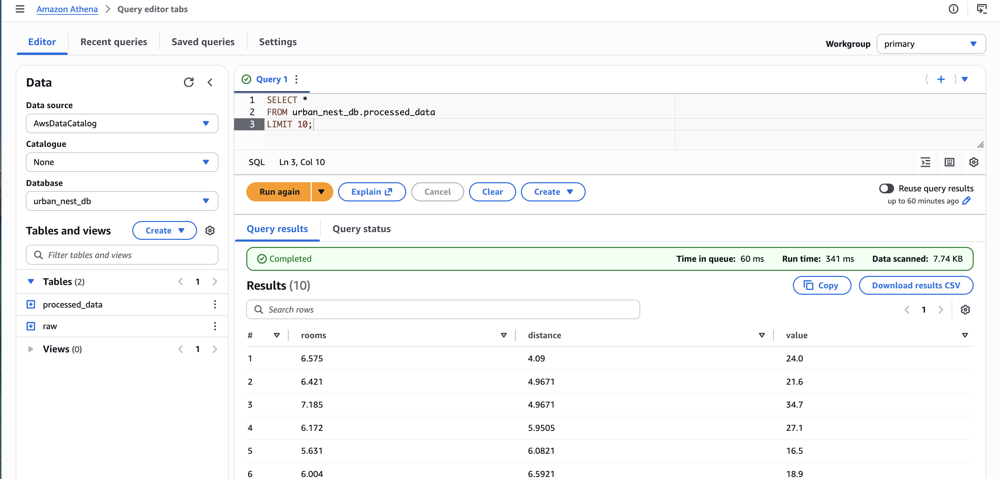

---

## Overview

For Week 1, I was given a scenario where I stepped into the role of a data engineer at a company called UrbanNest Property Analytics Ltd. The company had received a housing dataset and needed analysts to be able to query it using SQL. My job was to build the pipeline to make that happen.

The work involved uploading raw data to AWS S3, setting up a Glue Crawler to detect the schema, running an ETL job to clean and convert the data, and finally querying it through Amazon Athena.

---

## The Dataset

The file I worked with was `house_prices.csv` — a housing dataset with three columns:

| Column   | Description                          |
|----------|--------------------------------------|
| rooms    | Average number of rooms per property |
| distance | Distance from employment hubs        |
| value    | Median property value                |

It had 506 rows of real housing data. Simple enough to work with, but realistic enough to simulate what you would encounter on the job.

---

## How I Approached It

### Step 1 – Uploading the Data to S3

The first thing I did was create an S3 bucket called `urban-nest-data-lake-daniel-2026` and upload the CSV file into a folder called `raw/`. The idea behind having a `raw/` folder is to keep the original data untouched, which is standard practice in data engineering.

The file ended up at:

```
s3://urban-nest-data-lake-daniel-2026/raw/house_prices.csv
```



---

### Step 2 – Creating the Glue Database

Before running the crawler, I created a Glue database called `urban_nest_db`. This acts as a container for all the table metadata the crawler would generate. It does not store any actual data — just information about the data.



---

### Step 3 – Running the Glue Crawler

This was the part I found most interesting. I created a crawler called `urban-nest-house-crawler`, pointed it at the `raw/` folder in S3, and ran it. Within a couple of minutes it had automatically detected the three columns and their data types — without me having to define anything manually.

| Detail          | Value                                      |
|-----------------|--------------------------------------------|
| Crawler name    | urban-nest-house-crawler                   |
| Data source     | s3://urban-nest-data-lake-daniel-2026/raw/ |
| Output database | urban_nest_db                              |
| Status          | Succeeded                                  |



---

### Step 4 – Checking the Table Schema

Once the crawler finished, I went into the Glue Data Catalog to verify the table it had created. The three columns were correctly identified:

| Column   | Data Type |
|----------|-----------|
| rooms    | double    |
| distance | double    |
| value    | double    |



---

### Step 5 – Building the ETL Job

Using Glue Studio's Visual ETL, I built a job that reads from the Data Catalog, drops any rows with null values, and writes the cleaned data out as a Parquet file into the `processed/` folder in S3.

I chose Parquet because it is a compressed, columnar format that is significantly faster and cheaper to query than CSV — this is the format used in real production pipelines.

Output location:

```
s3://urban-nest-data-lake-daniel-2026/processed/
```



---

### Step 6 – Verifying the Processed Output

After the ETL job completed, I went back into S3 to confirm the Parquet file had landed in the `processed/` folder as expected.



---

### Step 7 – Querying with Amazon Athena

With everything in place, I opened Athena and ran two queries on the processed dataset.

**Query 1 – Average property value across all records:**

```sql
SELECT AVG(value)
FROM urban_nest_db.house_prices;
```

**Query 2 – Average value broken down by number of rooms:**

```sql
SELECT rooms, AVG(value)
FROM urban_nest_db.house_prices
GROUP BY rooms;
```

Both queries returned results without any issues, which confirmed the pipeline was working end to end.



---

## Deliverables

| Deliverable                         | Status | File                                  |
|-------------------------------------|--------|---------------------------------------|
| AWS Glue crawler screenshot         | Done   | Screenshot_3_Crawler_Completed.png    |
| Glue job workflow                   | Done   | Screenshot_6_Glue_ETL_Job_Success.png |
| Athena query results                | Done   | Screenshot_5_Athena_Query_Result.png  |
| Documentation of pipeline architecture | Done | architecture.md                    |

---

## What I Learned

Going into this I had a general idea of what S3 and Glue were, but actually building it from scratch made things much clearer. A few things stood out:

- The Glue Crawler saves a lot of time. Instead of manually defining column names and types, it reads the file and figures it out automatically.
- Having a `raw/` and `processed/` layer in S3 is not just good practice — it gives you a safety net. The original data is always there if something goes wrong.
- Parquet makes a real difference in query speed compared to CSV, especially as datasets get larger.
- Athena is genuinely useful — being able to run SQL directly on S3 without setting up a database server is a big deal for cost and simplicity.

---

## Author

**Name:** Daniel Jude

**Programme:** London Success Academy – Data Engineering

**Assignment:** Week 1 – Data Foundations & Cloud ETL

**Date:** March 2026
