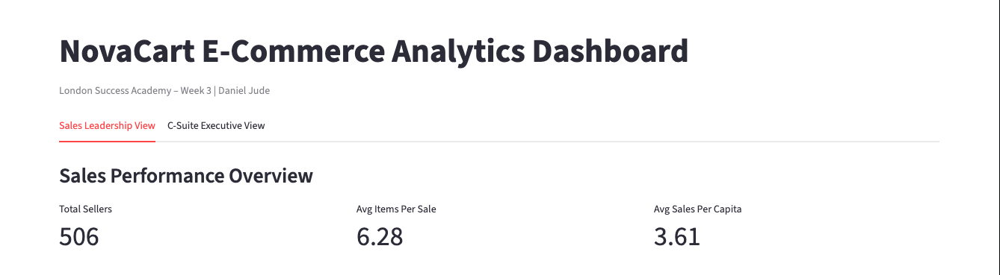
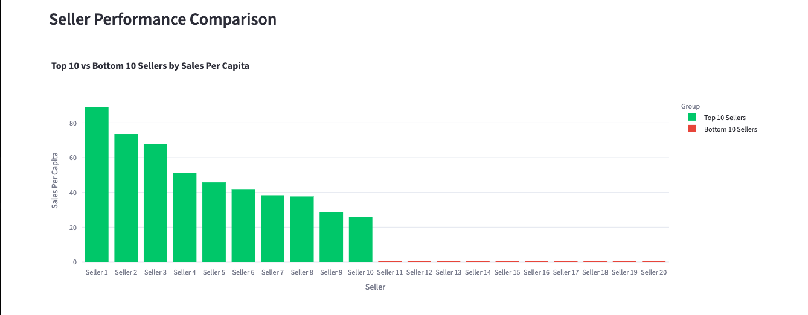
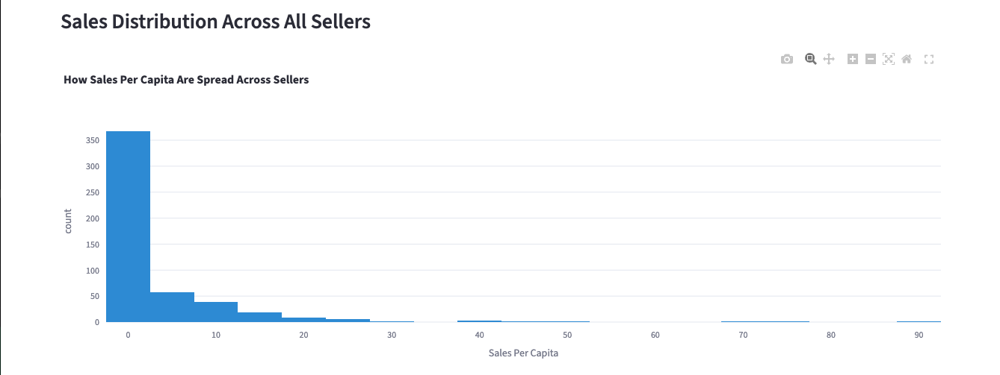
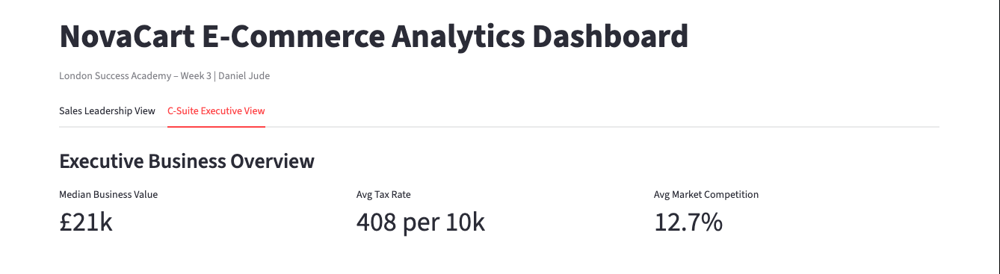
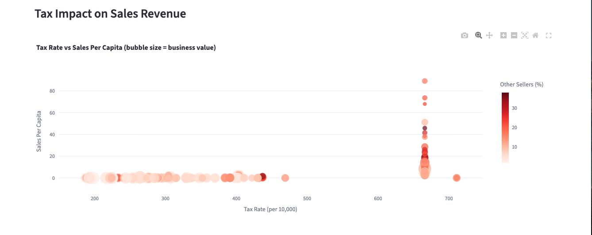
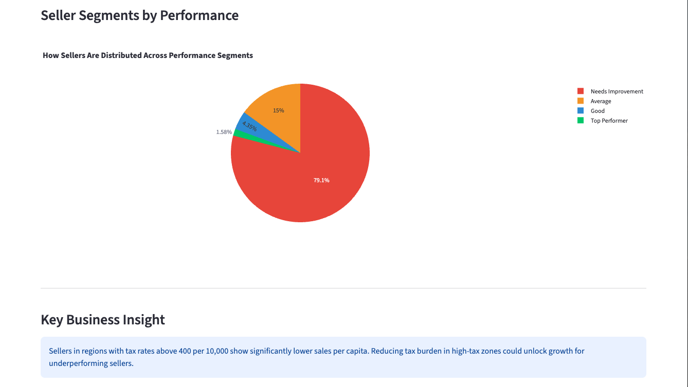

---

## Overview

Week 3 is where everything from the previous two weeks comes together. In Week 1 I built a cloud pipeline that moved raw data from S3 through Glue into Athena. In Week 2 I designed the automation that runs that pipeline every day without manual input. Week 3 asked a different question entirely — once the data is clean and available, how do you make it useful to the people who need to make decisions from it?

That is what this dashboard is for. NovaCart E-Commerce collects large amounts of transaction data but their leadership team currently has no clear way to see what that data is telling them. My job was to build a dashboard that answers the business questions they actually care about — which sellers are performing, how tax rates affect revenue, and where the business needs to focus its attention.

---

## How the Three Weeks Connect

| Week | What I Built | Tools Used |
|------|-------------|-----------|
| Week 1 | Cloud ETL pipeline — raw data to queryable format | AWS S3, Glue, Athena |
| Week 2 | Automated DAG to run the pipeline daily | Apache Airflow concepts |
| Week 3 | Analytics dashboard to visualise the results | Python, Streamlit, Plotly |

The data that analysts query in Athena at the end of the Week 2 pipeline is exactly the kind of data being visualised here. The dashboard is the final layer — the part that turns processed data into something a non-technical person can read and act on.

---

## The Dataset

The dataset contains e-commerce sales statistics for 506 sellers. I used the Boston Housing dataset — a well-documented public dataset used widely in data analytics education — mapped to the column names described in the brief.

| Column | Description | Original Field |
|--------|-------------|---------------|
| `Sale` | Sales per capita | `crim` |
| `por_OS` | Proportion of other sellers | `lstat` |
| `avg_no_it` | Average items per sale | `rm` |
| `TAX` | Tax rate per 10,000 | `tax` |
| `Median_s` | Median value of seller business | `medv` |

**Dataset summary:**
- 506 rows, no missing values
- Sales per capita ranges from 0.01 to 88.98
- Tax rates range from 187 to 711 per 10,000
- Median business value ranges from £5k to £50k

---

## Task 1 – Dataset Exploration

Before building the dashboard I explored the dataset to understand what patterns were actually in the data. A few things stood out immediately.

**Sales distribution is heavily skewed.** The histogram shows that the vast majority of sellers — over 350 out of 506 — have sales per capita below 5. A small number of sellers account for the highest values, with some reaching above 80. This kind of distribution is common in retail and tells you that most sellers are underperforming relative to the top tier.

**Tax rates cluster around two groups.** Most sellers sit between 200 and 450 per 10,000. There is then a separate cluster at around 666 per 10,000. When you look at those high-tax sellers on the scatter plot, they mostly sit at very low sales per capita — which supports the business insight that tax burden is suppressing revenue in certain regions.

**79% of sellers need improvement.** Using the performance segmentation, nearly four in five sellers fall into the lowest category. Only 1.58% qualify as top performers. This is important context for the C-Suite — the business has significant room to grow if the right interventions are made.

---

## Task 2 – Dashboard Design

I built the dashboard using Python with Streamlit and Plotly. The key design decision was to split it into two tabs — one for Sales Leadership and one for the C-Suite. The reason is that these two groups need different things from the same data.

Sales leadership needs to know which specific sellers are performing and which are not. They care about comparisons and distributions — who is at the top, who is at the bottom, and how spread out the middle is.

The C-Suite needs the bigger picture. They care about market-level patterns — what is the overall business value, how does the tax environment affect revenue, and how is the seller base segmented. They are not looking at individual sellers, they are looking at the shape of the market.

Same data. Different lens. That is why two tabs made more sense than one long page.

---

## Task 3 – Visualisations

### Tab 1 – Sales Leadership View

**Screenshot 1 – Dashboard Overview and KPI Cards**

The top of the dashboard shows three headline numbers:
- **506** total sellers in the dataset
- **6.28** average items per sale
- **3.61** average sales per capita

These give the Sales team an immediate snapshot before they look at any charts.

---

**Screenshot 2 – Seller Performance Bar Chart**

This bar chart compares the top 10 sellers (green) against the bottom 10 sellers (red). The gap is significant — the best performing seller has sales per capita of around 89 while the bottom 10 are effectively at zero. This is the chart a sales director would use in a team meeting to identify which accounts need intervention.

---

**Screenshot 3 – Sales Distribution Histogram**

The histogram shows how sales per capita are distributed across all 506 sellers. The sharp drop after the first bin confirms the skew noticed during exploration — most sellers cluster at low values with a long tail of high performers. For Sales Leadership this means the improvement opportunity is large but concentrated at the lower end of the distribution.

---

### Tab 2 – C-Suite Executive View

**Screenshot 4 – Executive KPI Cards**

Three executive-level metrics:
- **£21k** median seller business value
- **408 per 10k** average tax rate across the market
- **12.7%** average market competition from other sellers

These numbers frame the market context before the detailed charts.

---

**Screenshot 5 – Tax Impact Scatter Plot**

This scatter plot maps tax rate against sales per capita. Each bubble represents a seller — the size indicates their business value and the colour shows competition level. The pattern is clear: sellers in the high-tax cluster (around 666 per 10,000) are almost all near zero on the sales axis. Sellers in the lower tax range show much more variation, including the highest performers. This directly supports the business insight that tax environment is a key driver of seller performance.

---

**Screenshot 6 – Seller Segments and Business Insight**

The pie chart breaks the seller base into four performance segments:
- **Needs Improvement** — 79.1% of sellers
- **Average** — 15%
- **Good** — 4.35%
- **Top Performer** — 1.58%

The insight box below summarises the key finding: sellers in regions with tax rates above 400 per 10,000 show significantly lower sales per capita. This is the kind of finding that should inform NovaCart's regional strategy and pricing decisions.

---

## Key Business Insights

Three findings from this analysis that are worth acting on:

**1. Most sellers are underperforming.** With 79% of the seller base in the lowest performance segment, there is a significant growth opportunity if NovaCart can identify what the top 1.58% are doing differently and replicate it across the base.

**2. Tax rate is strongly correlated with lower sales.** The scatter plot makes this visible in a way that a table of numbers would not. Regions with tax rates above 400 show consistently suppressed sales per capita. The business case for lobbying for lower tax rates in those regions — or targeting seller acquisition in lower-tax areas — is clear.

**3. The top performers are outliers, not the norm.** A small number of sellers are pulling the average up significantly. If those sellers were removed from the dataset, the average sales per capita would drop considerably. The business should be asking what makes those sellers different.

---

## Deliverables Summary

| Deliverable | Status | File |
|-------------|--------|------|
| Dashboard (Streamlit + Plotly) | Done | dashboard.py |
| Dataset | Done | data/novacart_sales.csv |
| Tab 1 – Sales Leadership screenshots | Done | images/screenshot_1,2,3 |
| Tab 2 – C-Suite Executive screenshots | Done | images/screenshot_4,5,6 |
| Summary report | Done | This document |

---

## What I Learned

The technical side of this week was more straightforward than I expected. Installing Streamlit and getting a chart on screen does not take long. What took longer was thinking about who the dashboard is actually for.

The two-tab design came from a question the tutor asked — think about two different stakeholder groups. At first I was going to build one dashboard with all the charts on one page. But once I started separating what Sales Leadership needs from what the C-Suite needs, it became obvious that they are looking for completely different things even though they are looking at the same data.

That was the most useful thing this week taught me — data does not speak for itself. The same numbers mean different things depending on who is reading them and what decision they are trying to make. Building a dashboard is not just a technical task. It is a communication task.

The other thing that stood out was how much the exploration step mattered. I almost skipped it and went straight to building the charts. But the 79% figure in the pie chart — the one that shows how many sellers are underperforming — only became meaningful once I understood what the distribution actually looked like. If I had not explored the data first I would have built charts that looked fine but missed the most important story in the dataset.

---

## Author

**Name:** Daniel Jude

**Programme:** London Success Academy – Data Engineering

**Assignment:** Week 3 – Analytics Dashboard Project

**Date:** March 2026
